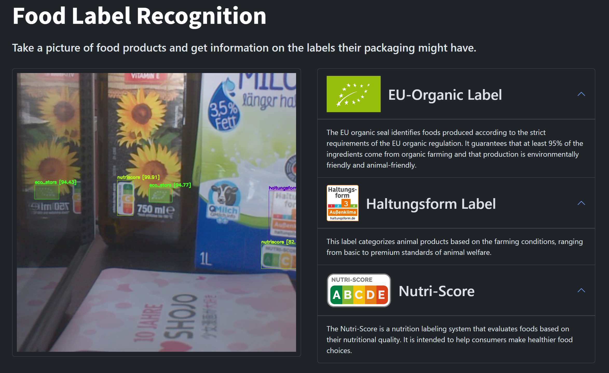

# Food Label Guide

Webapp for recognizing food labels on products and providing the user information about them. Works for the 26 most common food labels in found in Germany. Runs with minimal hardware resources on the Jetson Nano device using a YOLOv4-tiny model trained on photos taken in german supermarkets. The webapp has modes for both taking single images and capturing video with live label detection using the Jetson Nano's CSI camera.
Made as an university project during the AISS CV course at KIT.
Below is a screenshot of the website during a live camera stream.


## Project

The frontend is a webapp showing information on detected labels. The web server uses the Flask framework. The website is built with HTML, CSS, and vanilla JavaScript. 
Two different modes for either using single pictures or video stream are available.

The backend is a YOLOv4-tiny object detection model loaded into the Darknet framework. It is accessed using a python wrapper. 
A demo showcasing the standalone model applied to video stream is available.

## Setup

The final runnable program is located in the `main` folder. The instructions are based on it as the starting directory.
All code is expected to be run on the Jetson Nano device.

1. Install all packages specified in the `requirements.txt` file
2. Run `sudo python3 setup.py install` to install our custom modules
3. Try starting the demo as specified below. If there is an error with the model, you most likely need to compile Darknet from scratch to make the model work. Please refer to the detailed instructions [here](main/backend/model/README.md).

## Starting the program

Bash scripts are available to easily run all important parts of our project.

### Running the **demo**:

Run our YOLO model in standalone mode with a video stream from the camera:
```
$ bash demo_start.sh
```
Press `Q` to stop the demo.

### Running the web app for **video stream**:

Run the web server in the terminal. It will start the camera by itself.
When you load the website (the device's IP address), the video stream will immediately start and show the live detected labels.

#### Start the web server:
```
$ bash video_server_start.sh
```
Press `Ctrl+C` inside the terminal window to stop the frontend.

### Running the web app for **single images**:

Run the web server and the camera in two different terminal windows.
When you take a picture, the website (the device's IP address) shows it and the labels detected in it.

#### Start the web server:
```
$ bash image_server_start.sh
```
Press `Ctrl+C` inside the terminal window to stop the frontend.

#### Start the camera:
```
$ bash camera_start.sh
```
You can take a picture by entering `J` into the terminal.

Press `Ctrl+C` or enter `Q` to stop the camera.
